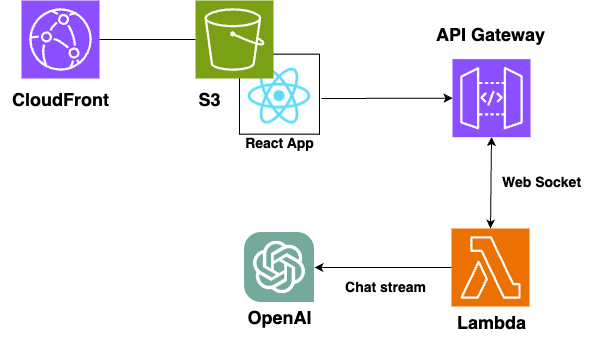

# react-study
Reactの勉強
ChatGPTアプリを作る

# 成果物
https://d1vqxzlly8xhg7.cloudfront.net/

# 構成図

# 参考
* [ChatGPTアプリを作って学ぶReact](https://techbookfest.org/product/qJcZv2Lqr8nkjSsW3DxNrD?productVariantID=5qBQ2kMLrRxrt6kyfpMJ1Q)
* [S3+CloudFrontを使ってReactアプリを独自ドメイン on HTTPSで公開する](https://qiita.com/saki-engineering/items/b344f3617365978cb74d)
* [WebSocketを用いてChatGPT APIのレスポンスをストリーム送信する](https://qiita.com/hama1080/items/849888c4e6dfabf92cd2)
